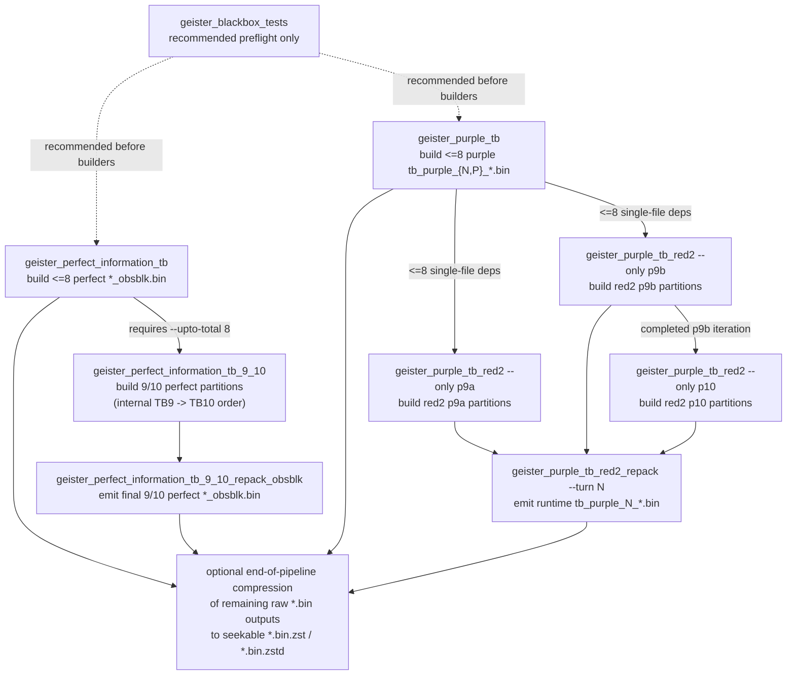

# Unweaver-TwoColorEscapeBoardGameAI

Geister endgame tablebase 

### The tablebase can be downloaded from the following location:

https://huggingface.co/datasets/ubiquitin/unweaver-tablebase

## Typical build workflow

### Linux (including tablebase construction scripts and a game AI):

```bash
./install_public_build_deps.sh
./prepare_seekable_zstd.sh
./build_public.sh
```

- Run `./run_public_tb_pipeline.sh` to generate the tablebase

### Windows (only for a game AI):

- Install Visual Studio

```bash
.\prepare_seekable_zstd.cmd
.\build_windows_baseline_player.cmd
```

## Build prerequisites

- `clang++` (or versioned `clang++-NN`) with C++20 modules support
- BMI2-capable target (`-mbmi2` is enabled by default)
- seekable-zstd helper objects prepared by `prepare_seekable_zstd.sh`
- for builder binaries, a working OpenMP setup for your compiler

Constructing tablebase can be performed on computers with 128GB of main memory.

## Build script behavior

- `./build_public.sh` now defaults to host-optimized binaries (`-march=native -mtune=native -mbmi2 -mbmi`) so the no-option path aims for the fastest output on the current machine.
- Use `./build_public.sh --portable` when you want to drop `-march/-mtune=native` while still keeping BMI2 enabled.
- LTO is auto-detected. When the local toolchain can link `-flto`, the script uses it; otherwise it automatically falls back to a non-LTO build. Use `--lto` to require it or `--no-lto` to disable it.

## Included components

- `geister_stdio_baseline_player.cpp`
  - stdio player for match servers
  - starts perfect-information and purple tablebase preload immediately at process startup
  - move-selection order:
    1. immediate protocol-level escape if a blue piece is already on A1/F1
    2. `proven_escape_move()` if it can certify a sound escape-race first move
    3. `purple_winning_move()` if the N-side purple runtime can certify a shortest winning on-board move by 2-ply minimax
    4. `confident_player()` if the perfect-information runtime fully covers the position
    5. otherwise `random_player()`
  - if `confident_player()` returns a non-empty `vector<move>`, it chooses one of those best moves with a position-derived pseudo-random tie-break (same position => same choice)
  - usage: `./geister_stdio_baseline_player [TB_DIR]`
    - if `TB_DIR` is omitted, only the current directory is scanned

- Runtime modules
  - `geister_tb_handler.cxx`
  - `geister_proven_escape.cxx`
  - `geister_purple_winning.cxx`
  - `confident_player.cxx`
  - `tablebase_io.cxx`
  - rank/core/interface modules

- <=8 builders
  - `geister_perfect_information_tb.cpp`
  - `geister_purple_tb.cpp`

- Dedicated 9/10 builders
  - `geister_perfect_information_tb_9_10.cpp`
  - `geister_perfect_information_tb_9_10_repack_obsblk.cpp`
  - `geister_purple_tb_red2.cpp`
  - `geister_purple_tb_red2_repack.cpp`

## Runtime behavior

The public runtime handler supports two load paths.

- `load_all_bins()` performs a synchronous scan + mmap of the current directory.
- `start_background_load()` launches that work in a detached thread.

While background loading is still running, both perfect-information and purple probes behave exactly as if no tablebase were loaded yet and return `std::nullopt`.

`geister_proven_escape.cxx` is a conservative pre-tablebase tactical filter. It tries to certify an on-board first move that guarantees an eventual escape win under an opponent-favoring sufficient condition (false negatives are acceptable; false positives are not). If no move is certified, the caller proceeds to the normal tablebase-backed policy.

`geister_purple_winning.cxx` is a compact purple-tablebase tactical certifier. It probes the Normal-side purple runtime on the current position, then performs a 2-ply minimax check over all legal replies and chooses a shortest certified winning move when one exists. If the runtime is not ready, the position is outside loaded purple coverage, or no winning move can be certified, it returns `std::nullopt`.

`confident_player.cxx` is included as a compact example of how to call the perfect-information tablebase from a game AI that only has public information. It enumerates all opponent colorings consistent with the current observation, probes the 1-ply child positions in the perfect-information runtime, and returns the best fully covered moves. If the runtime is not ready or the position is outside currently loaded perfect-information coverage, it returns `std::nullopt` and lets the caller fall back to another policy.

## Naming / formats

### Perfect-information runtime

The public runtime expects observation-block (`obsblk`) perfect-information tables.

- raw: `idXXX_pbPprRobSorT_obsblk.bin`
- seekable zstd: `idXXX_pbPprRobSorT_obsblk.bin.zst` or `.zstd`

The public <=8 perfect builder now writes `_obsblk.bin` directly as its runtime output.
By default it does **not** emit `.txt` side files; pass `--write-txt` only when you explicitly want them for debugging or inspection.

The dedicated 9/10 perfect builder consumes <=8 perfect `_obsblk.bin` dependencies directly. Legacy headerless `.bin` files are still accepted as a fallback for compatibility, but they are no longer required.

### Purple runtime

The public purple runtime reads **Normal-side single-file tables only**.

- raw: `tb_purple_N_kK_pbP_prR_ppQ.bin`
- seekable zstd: `tb_purple_N_kK_pbP_prR_ppQ.bin.zst`

The runtime intentionally ignores:

- `tb_purple_P_*`
- partitioned red2 intermediates such as `*_partXX.bin`
- `.bin.zstd` purple files

`geister_purple_tb.cpp` produces <=8 purple single-file `.bin` outputs directly.
`geister_purple_tb_red2.cpp` produces partitioned red2 intermediates, and `geister_purple_tb_red2_repack.cpp --turn N` converts the final red2 iterations into runtime-ready `tb_purple_N_*.bin`.

## Builder dependency graph

The order used by `run_public_tb_pipeline.sh` is **one valid topological ordering** of the builder-dependency DAG.  
It is **not** the only legal order. Any execution order that respects the dependency edges below is fine.

`geister_blackbox_tests` is shown as a recommended preflight step. It is not a tablebase data dependency, so the arrow from it is dotted.



Practical interpretation:

- `geister_perfect_information_tb` must run first with `--upto-total 8`, because the dedicated 9/10 perfect builder depends on those <=8 runtime tables.
- `geister_perfect_information_tb_9_10` must wait until the <=8 perfect `_obsblk.bin` files exist.
- `geister_perfect_information_tb_9_10_repack_obsblk` must wait for `geister_perfect_information_tb_9_10`.
- `geister_purple_tb` must run before the red2 purple builder, because `p9a` and `p9b` consume <=8 purple single-file dependencies.
- `geister_purple_tb_red2 --only p10` must wait for the completed `p9b` iteration selected for reuse.
- `geister_purple_tb_red2_repack --turn N` must wait until the final `p9a`, `p9b`, and `p10` red2 iterations exist.
- The final batch compression step is intentionally placed at the end because downstream builder binaries consume raw `.bin` / `_obsblk.bin` inputs. Compress those files only after all downstream builders that still need the raw files have finished.
