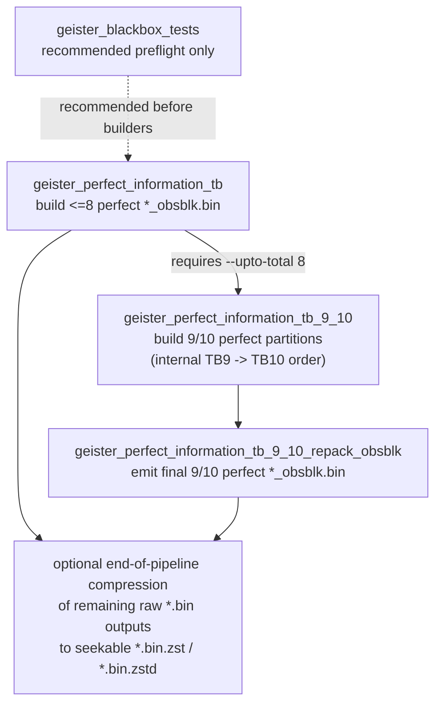

# Unweaver-TwoColorEscapeBoardGameAI

Geister endgame tablebase 

## Typical build flow

```bash
./install_public_build_deps.sh
./prepare_seekable_zstd.sh
./build_public.sh
```

## Build prerequisites

- `clang++` (or versioned `clang++-NN`) with C++20 modules support
- BMI2-capable target (`-mbmi2` is enabled by default)
- seekable-zstd helper objects prepared by `prepare_seekable_zstd.sh`
- for builder binaries, a working OpenMP setup for your compiler

## Included components

- `geister_stdio_baseline_player.cpp`
  - stdio player for match servers
  - starts perfect-information tablebase preload immediately at process startup
  - if `confident_player()` returns a non-empty `vector<move>`, it chooses uniformly at random among those best moves
  - otherwise it falls back to `random_player()`
  - usage: `./geister_stdio_baseline_player [TB_DIR]`
    - if `TB_DIR` is omitted, only the current directory is scanned

- Runtime modules
  - `geister_tb_handler.cxx`
  - `confident_player.cxx`
  - `tablebase_io.cxx`
  - rank/core/interface modules

- <=8 builders
  - `geister_perfect_information_tb.cpp`

- Dedicated 9/10 builders
  - `geister_perfect_information_tb_9_10.cpp`
  - `geister_perfect_information_tb_9_10_repack_obsblk.cpp`

## Runtime behavior

The public runtime handler supports two load paths.

- `load_all_bins()` performs a synchronous scan + mmap of the current directory.
- `start_background_load()` launches that work in a detached thread.

While background loading is still running, probes behave exactly as if no tablebase were loaded yet and return `std::nullopt`.

`confident_player.cxx` is included as a compact example of how to call the perfect-information tablebase from a game AI that only has public information. It enumerates all opponent colorings consistent with the current observation, probes the 1-ply child positions in the perfect-information runtime, and returns the best fully covered moves. If the runtime is not ready or the position is outside currently loaded perfect-information coverage, it returns `std::nullopt` and lets the caller fall back to another policy.

## Naming / formats

### Perfect-information runtime

The public runtime expects observation-block (`obsblk`) perfect-information tables.

- raw: `idXXX_pbPprRobSorT_obsblk.bin`
- seekable zstd: `idXXX_pbPprRobSorT_obsblk.bin.zst` or `.zstd`

The public <=8 perfect builder now writes `_obsblk.bin` directly as its runtime output.
By default it does **not** emit `.txt` side files; pass `--write-txt` only when you explicitly want them for debugging or inspection.

The dedicated 9/10 perfect builder consumes <=8 perfect `_obsblk.bin` dependencies directly. Legacy headerless `.bin` files are still accepted as a fallback for compatibility, but they are no longer required.

## Builder dependency graph

The order used by `run_public_tb_pipeline.sh` is **one valid topological ordering** of the builder-dependency DAG.  
It is **not** the only legal order. Any execution order that respects the dependency edges below is fine.

`geister_blackbox_tests` is shown as a recommended preflight step. It is not a tablebase data dependency, so the arrow from it is dotted.



Practical interpretation:

- `geister_perfect_information_tb` must run first with `--upto-total 8`, because the dedicated 9/10 perfect builder depends on those <=8 runtime tables.
- `geister_perfect_information_tb_9_10` must wait until the <=8 perfect `_obsblk.bin` files exist.
- `geister_perfect_information_tb_9_10_repack_obsblk` must wait for `geister_perfect_information_tb_9_10`.
- The final batch compression step is intentionally placed at the end because the downstream builder binaries consume raw <=8 `.bin` / `_obsblk.bin` inputs. Compress those files only after all downstream builders that still need the raw files have finished.
